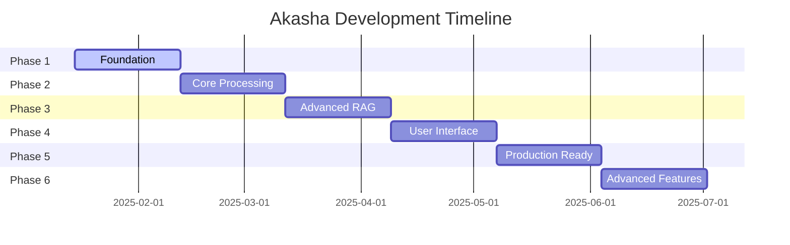
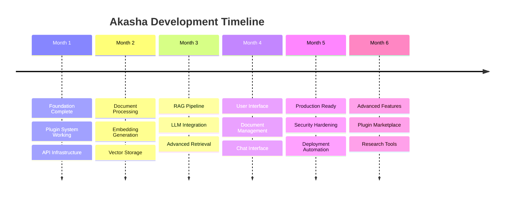

# Akasha Development Roadmap

## Table of Contents
1. [Overview](#1-overview)
2. [Development Phases](#2-development-phases)
3. [Phase 1: Foundation (Weeks 1-4)](#3-phase-1-foundation-weeks-1-4)
4. [Phase 2: Core Processing (Weeks 5-8)](#4-phase-2-core-processing-weeks-5-8)
5. [Phase 3: Advanced RAG (Weeks 9-12)](#5-phase-3-advanced-rag-weeks-9-12)
6. [Phase 4: User Interface (Weeks 13-16)](#6-phase-4-user-interface-weeks-13-16)
7. [Phase 5: Production Readiness (Weeks 17-20)](#7-phase-5-production-readiness-weeks-17-20)
8. [Phase 6: Advanced Features (Weeks 21-24)](#8-phase-6-advanced-features-weeks-21-24)
9. [Future Enhancements](#9-future-enhancements)
10. [Risk Management](#10-risk-management)
11. [Success Metrics](#11-success-metrics)
12. [Resource Planning](#12-resource-planning)

---

## 1. Overview

This roadmap outlines the development plan for the Akasha multimodal RAG system, structured in phases that deliver incremental value while building toward the complete vision outlined in the system architecture.

### 1.1 Project Goals

- **Primary**: Build a production-ready, modular multimodal RAG system
- **Timeline**: 24 weeks (6 months) to MVP, with ongoing development
- **Approach**: Agile development with 4-week phases
- **Quality**: Maintain high code quality, comprehensive testing, and documentation

### 1.2 Key Principles

- **Modularity First**: Every component should be independently replaceable
- **Quality Over Speed**: Proper testing and documentation at each phase
- **User-Centered**: Regular user feedback and validation
- **Performance-Aware**: Optimize for real-world usage patterns
- **Community-Ready**: Open architecture for contributions

### 1.3 Technology Stack Decisions

| Component | Technology | Rationale |
|-----------|------------|-----------|
| **Backend** | Python 3.11+ with FastAPI | Excellent ML ecosystem, async support |
| **Frontend** | React + TypeScript | Modern, component-based, type-safe |
| **Document Processing** | MinerU 2 | SOTA PDF extraction with multimodal support |
| **Embeddings** | JINA v4 | Best-in-class multimodal embeddings |
| **Vector Store** | ChromaDB → Qdrant | Development simplicity → production scale |
| **LLM** | Gemma 3 27B via MLX/llama.cpp | Good performance, local deployment |
| **Containerization** | Docker + Compose | Consistent deployment, easy scaling |

---

## 2. Development Phases

### 2.1 Phase Overview



### 2.2 Phase Deliverables Summary

| Phase | Duration | Key Deliverables | Success Criteria |
|-------|----------|------------------|------------------|
| **1. Foundation** | 4 weeks | Core architecture, basic API, config system | Working REST API, plugin framework |
| **2. Core Processing** | 4 weeks | Document ingestion, embeddings, vector storage | Process PDFs, generate embeddings |
| **3. Advanced RAG** | 4 weeks | Multi-stage retrieval, LLM integration | End-to-end Q&A functionality |
| **4. User Interface** | 4 weeks | Web UI, document management, chat interface | Complete user workflow |
| **5. Production Ready** | 4 weeks | Deployment, monitoring, security | Production deployment ready |
| **6. Advanced Features** | 4 weeks | GraphRAG, Self-RAG, advanced plugins | SOTA RAG capabilities |

---

## 3. Phase 1: Foundation (Weeks 1-4)

### 3.1 Objectives

Establish the core system architecture, plugin framework, and basic API infrastructure that will support all future development.

### 3.2 Week 1: Project Setup and Core Architecture

#### Goals
- Set up development environment and project structure
- Implement basic configuration system
- Create plugin architecture foundation

#### Deliverables
```
akasha/
├── src/
│   ├── core/
│   │   ├── __init__.py
│   │   ├── config.py          ✓ Configuration management
│   │   ├── logging.py         ✓ Structured logging
│   │   └── exceptions.py      ✓ Custom exceptions
│   ├── plugins/
│   │   ├── __init__.py
│   │   ├── base.py           ✓ Plugin interfaces
│   │   ├── manager.py        ✓ Plugin management
│   │   └── registry.py       ✓ Plugin registry
│   └── api/
│       ├── __init__.py
│       └── main.py           ✓ FastAPI application
├── tests/
├── docs/
├── docker-compose.yml        ✓ Development setup
├── requirements.txt          ✓ Dependencies
└── pyproject.toml           ✓ Modern packaging
```

#### Tasks
- [ ] Project structure and tooling setup
- [ ] Configuration system with YAML + Pydantic validation
- [ ] Logging infrastructure with structured output
- [ ] Plugin interface definitions and base classes
- [ ] Plugin manager with discovery and loading
- [ ] Basic FastAPI application with health endpoints
- [ ] Docker development environment
- [ ] CI/CD pipeline setup (GitHub Actions)

### 3.3 Week 2: API Foundation and Plugin System

#### Goals
- Implement core API endpoints
- Complete plugin loading and management system
- Set up testing framework

#### Deliverables
- RESTful API with OpenAPI documentation
- Working plugin system with hot-reloading
- Comprehensive test suite setup

#### Tasks
- [ ] API route structure and middleware
- [ ] Plugin registration and activation system
- [ ] Plugin sandboxing and security model
- [ ] Request/response validation with Pydantic
- [ ] Error handling and logging integration
- [ ] Authentication framework (API keys)
- [ ] Unit test framework with pytest
- [ ] Integration test setup with test client

### 3.4 Week 3: Configuration and Storage Layer

#### Goals
- Complete configuration management system
- Implement basic storage abstractions
- Create database schema and migrations

#### Deliverables
- Environment-aware configuration system
- Storage interface with multiple backends
- Database setup for metadata storage

#### Tasks
- [ ] Hierarchical configuration loading
- [ ] Environment variable overrides
- [ ] Configuration validation and defaults
- [ ] Abstract storage interfaces
- [ ] File system storage implementation
- [ ] Metadata database schema design
- [ ] Database migration system
- [ ] Configuration API endpoints

### 3.5 Week 4: Monitoring and Documentation

#### Goals
- Set up monitoring and metrics collection
- Complete API documentation
- Establish development workflow

#### Deliverables
- Monitoring dashboard and metrics
- Complete API documentation
- Developer setup guide

#### Tasks
- [ ] Prometheus metrics integration
- [ ] Health check endpoints with detailed status
- [ ] API documentation with examples
- [ ] Development setup documentation
- [ ] Code quality tools (linting, formatting)
- [ ] Pre-commit hooks setup
- [ ] Performance benchmarking framework
- [ ] Security scanning setup

### 3.6 Phase 1 Success Criteria

- ✅ Working REST API with authentication
- ✅ Plugin system can load and manage plugins
- ✅ Configuration system handles all environments
- ✅ Comprehensive test coverage (>80%)
- ✅ Complete developer documentation
- ✅ CI/CD pipeline passes all checks
- ✅ Docker development environment working
- ✅ Monitoring and logging functional

---

## 4. Phase 2: Core Processing (Weeks 5-8)

### 4.1 Objectives

Implement the core document processing pipeline, embedding generation, and vector storage capabilities that form the foundation of the RAG system.

### 4.2 Week 5: Document Ingestion Engine

#### Goals
- Integrate MinerU 2 for PDF processing
- Implement document segmentation pipeline
- Create content classification system

#### Deliverables
- Working PDF to structured content pipeline
- Document upload and processing API
- Content segmentation with metadata

#### Tasks
- [ ] MinerU 2 integration and configuration
- [ ] Document upload API with file validation
- [ ] PDF parsing and content extraction
- [ ] Text, image, and table segmentation
- [ ] OCR fallback for scanned documents
- [ ] Metadata extraction (title, authors, etc.)
- [ ] Content classification (headers, body, etc.)
- [ ] Document processing status tracking

### 4.3 Week 6: Embedding Service

#### Goals
- Integrate JINA v4 multimodal embeddings
- Implement embedding generation pipeline
- Set up embedding caching system

#### Deliverables
- JINA v4 embedding service
- Multimodal embedding generation
- Embedding cache with persistence

#### Tasks
- [ ] JINA v4 model integration
- [ ] Text embedding generation
- [ ] Image embedding generation
- [ ] Multimodal content embedding
- [ ] Batch processing for efficiency
- [ ] Embedding caching with Redis/disk
- [ ] Embedding API endpoints
- [ ] Performance optimization and profiling

### 4.4 Week 7: Vector Storage

#### Goals
- Implement vector storage with ChromaDB
- Create vector search capabilities
- Set up hybrid search infrastructure

#### Deliverables
- Vector storage with ChromaDB
- Similarity search functionality
- Hybrid search combining semantic and keyword

#### Tasks
- [ ] ChromaDB integration and setup
- [ ] Vector storage with metadata
- [ ] Similarity search implementation
- [ ] Keyword search with Whoosh/Elasticsearch
- [ ] Hybrid search with result fusion
- [ ] Vector database management API
- [ ] Search result ranking and filtering
- [ ] Index optimization and maintenance

### 4.5 Week 8: Processing Pipeline Integration

#### Goals
- Connect all processing components
- Implement end-to-end document processing
- Add processing queue and job management

#### Deliverables
- Complete document processing pipeline
- Job queue for async processing
- Document management API

#### Tasks
- [ ] End-to-end processing workflow
- [ ] Async job queue with Celery/RQ
- [ ] Processing status and progress tracking
- [ ] Error handling and retry logic
- [ ] Document CRUD operations
- [ ] Bulk document processing
- [ ] Processing analytics and metrics
- [ ] Performance testing and optimization

### 4.6 Phase 2 Success Criteria

- ✅ Successfully process PDF documents with MinerU 2
- ✅ Generate multimodal embeddings with JINA v4
- ✅ Store and search vectors in ChromaDB
- ✅ Hybrid search returns relevant results
- ✅ Process 100+ page documents in <2 minutes
- ✅ Handle 1000+ documents in vector store
- ✅ API supports document upload and search
- ✅ Processing pipeline handles errors gracefully

---

## 5. Phase 3: Advanced RAG (Weeks 9-12)

### 5.1 Objectives

Implement advanced retrieval techniques and integrate LLM capabilities to create a complete RAG system with state-of-the-art features.

### 5.2 Week 9: Multi-Stage Retrieval

#### Goals
- Implement advanced retrieval pipeline
- Add query expansion and reranking
- Create contextual retrieval system

#### Deliverables
- Multi-stage retrieval pipeline
- Query expansion capabilities
- Cross-encoder reranking

#### Tasks
- [ ] Coarse-to-fine retrieval pipeline
- [ ] Query expansion with synonyms and concepts
- [ ] Cross-encoder reranking implementation
- [ ] Contextual retrieval with conversation history
- [ ] Retrieval result aggregation and fusion
- [ ] Relevance scoring improvements
- [ ] Retrieval analytics and debugging
- [ ] A/B testing framework for retrieval

### 5.3 Week 10: LLM Integration

#### Goals
- Integrate Gemma 3 27B with MLX/llama.cpp
- Implement streaming generation
- Create prompt management system

#### Deliverables
- Working LLM service with multiple backends
- Streaming text generation
- Prompt template system

#### Tasks
- [ ] MLX backend integration for Apple Silicon
- [ ] llama.cpp backend for cross-platform support
- [ ] Model loading and management system
- [ ] Streaming text generation API
- [ ] Prompt template engine
- [ ] Context length management
- [ ] Generation parameter tuning
- [ ] Model performance optimization

### 5.4 Week 11: RAG Engine Implementation

#### Goals
- Create complete RAG pipeline
- Implement citation and source tracking
- Add conversation management

#### Deliverables
- End-to-end RAG system
- Citation and source attribution
- Conversation history management

#### Tasks
- [ ] RAG pipeline connecting retrieval and generation
- [ ] Source attribution and citation generation
- [ ] Conversation context management
- [ ] Multi-turn conversation support
- [ ] Answer quality validation
- [ ] Response streaming with sources
- [ ] RAG evaluation metrics
- [ ] User feedback collection

### 5.5 Week 12: Advanced RAG Features

#### Goals
- Implement GraphRAG capabilities
- Add Self-RAG reflection mechanisms
- Create advanced query understanding

#### Deliverables
- GraphRAG entity and relationship extraction
- Self-RAG reflection system
- Advanced query processing

#### Tasks
- [ ] Entity and relationship extraction
- [ ] Knowledge graph construction
- [ ] GraphRAG path-based retrieval
- [ ] Self-RAG reflection prompts
- [ ] Query validation and reformulation
- [ ] Answer confidence scoring
- [ ] Multi-modal query understanding
- [ ] Advanced evaluation framework

### 5.6 Phase 3 Success Criteria

- ✅ Complete RAG pipeline from query to response
- ✅ Multi-stage retrieval improves result quality
- ✅ LLM generates coherent responses with citations
- ✅ Streaming responses work smoothly
- ✅ GraphRAG provides relationship-based insights
- ✅ Self-RAG improves answer accuracy
- ✅ System handles complex multi-turn conversations
- ✅ Response time <3 seconds for typical queries

---

## 6. Phase 4: User Interface (Weeks 13-16)

### 6.1 Objectives

Create a complete user interface that showcases the system's capabilities and provides an intuitive experience for researchers and knowledge workers.

### 6.2 Week 13: React Frontend Foundation

#### Goals
- Set up React application with TypeScript
- Implement basic routing and layout
- Connect to API backend

#### Deliverables
- React application with routing
- Basic UI components library
- API client integration

#### Tasks
- [ ] React + TypeScript project setup
- [ ] UI component library (Material-UI/Chakra)
- [ ] Routing with React Router
- [ ] API client with auto-generated types
- [ ] Authentication state management
- [ ] Error handling and notifications
- [ ] Responsive design foundation
- [ ] Dark/light theme support

### 6.3 Week 14: Document Management Interface

#### Goals
- Create document upload and management UI
- Implement document viewer
- Add document metadata editing

#### Deliverables
- Document upload interface
- Document library with search/filter
- Document viewer with annotations

#### Tasks
- [ ] Drag-and-drop document upload
- [ ] Upload progress and status tracking
- [ ] Document library with pagination
- [ ] Document preview and viewer
- [ ] Metadata editing interface
- [ ] Document tagging and categorization
- [ ] Bulk operations (delete, tag, etc.)
- [ ] Document processing status display

### 6.4 Week 15: Search and Chat Interface

#### Goals
- Create advanced search interface
- Implement chat interface with streaming
- Add visual similarity search

#### Deliverables
- Advanced search with filters
- Real-time chat interface
- Visual search capabilities

#### Tasks
- [ ] Advanced search interface with filters
- [ ] Search result display with highlighting
- [ ] Chat interface with message history
- [ ] Streaming response display
- [ ] Image upload for visual search
- [ ] Search suggestions and autocomplete
- [ ] Conversation management (save/load)
- [ ] Source citation display

### 6.5 Week 16: Visualization and Analytics

#### Goals
- Add knowledge graph visualization
- Create analytics dashboard
- Implement user preferences

#### Deliverables
- Interactive knowledge graph
- Usage analytics dashboard
- User settings and preferences

#### Tasks
- [ ] Knowledge graph visualization (D3.js/Cytoscape)
- [ ] Interactive graph exploration
- [ ] Usage analytics dashboard
- [ ] User activity tracking
- [ ] System performance metrics display
- [ ] User preferences and settings
- [ ] Export functionality (PDF, citations)
- [ ] Accessibility improvements (WCAG compliance)

### 6.6 Phase 4 Success Criteria

- ✅ Intuitive document upload and management
- ✅ Responsive design works on all devices
- ✅ Real-time chat with streaming responses
- ✅ Advanced search with multiple filters
- ✅ Knowledge graph visualization is interactive
- ✅ Application loads in <3 seconds
- ✅ Accessibility score >95% (Lighthouse)
- ✅ User testing shows high satisfaction

---

## 7. Phase 5: Production Readiness (Weeks 17-20)

### 7.1 Objectives

Prepare the system for production deployment with proper security, monitoring, deployment automation, and performance optimization.

### 7.2 Week 17: Security and Authentication

#### Goals
- Implement comprehensive authentication system
- Add authorization and access control
- Security hardening and audit

#### Deliverables
- Production-ready authentication
- Role-based access control
- Security audit report

#### Tasks
- [ ] JWT-based authentication system
- [ ] Role-based access control (RBAC)
- [ ] API rate limiting and throttling
- [ ] Input validation and sanitization
- [ ] SQL injection prevention
- [ ] XSS and CSRF protection
- [ ] Security headers implementation
- [ ] Vulnerability scanning and fixes

### 7.3 Week 18: Deployment and Infrastructure

#### Goals
- Create production deployment setup
- Implement container orchestration
- Set up CI/CD pipeline

#### Deliverables
- Production Docker setup
- Kubernetes/docker-compose deployment
- Automated CI/CD pipeline

#### Tasks
- [ ] Production Dockerfile optimization
- [ ] Kubernetes manifests and Helm charts
- [ ] Docker Compose production setup
- [ ] Environment-specific configurations
- [ ] Automated deployment pipeline
- [ ] Database migration automation
- [ ] Backup and recovery procedures
- [ ] Load balancing configuration

### 7.4 Week 19: Monitoring and Observability

#### Goals
- Implement comprehensive monitoring
- Set up logging and alerting
- Create performance dashboards

#### Deliverables
- Monitoring stack (Prometheus/Grafana)
- Centralized logging
- Alert system

#### Tasks
- [ ] Prometheus metrics collection
- [ ] Grafana dashboards creation
- [ ] Centralized logging (ELK/Loki)
- [ ] Application performance monitoring
- [ ] Error tracking and alerting
- [ ] Resource usage monitoring
- [ ] User activity analytics
- [ ] SLA monitoring and reporting

### 7.5 Week 20: Performance Optimization

#### Goals
- Optimize system performance
- Implement caching strategies
- Load testing and tuning

#### Deliverables
- Performance-optimized system
- Comprehensive caching
- Load testing results

#### Tasks
- [ ] Database query optimization
- [ ] API endpoint performance tuning
- [ ] Multi-level caching implementation
- [ ] CDN setup for static assets
- [ ] Database connection pooling
- [ ] Async processing optimization
- [ ] Load testing with realistic data
- [ ] Performance regression testing

### 7.6 Phase 5 Success Criteria

- ✅ System passes security audit
- ✅ Automated deployment works reliably
- ✅ Monitoring covers all system components
- ✅ System handles 100+ concurrent users
- ✅ 99.9% uptime with proper alerting
- ✅ API response time <500ms (95th percentile)
- ✅ Backup and recovery tested
- ✅ Documentation complete for operations

---

## 8. Phase 6: Advanced Features (Weeks 21-24)

### 8.1 Objectives

Implement cutting-edge features that differentiate Akasha and provide advanced capabilities for power users and researchers.

### 8.2 Week 21: Advanced Plugin System

#### Goals
- Complete plugin marketplace
- Implement plugin sandboxing
- Create plugin development tools

#### Deliverables
- Plugin marketplace and registry
- Secure plugin execution
- Plugin development SDK

#### Tasks
- [ ] Plugin marketplace UI and backend
- [ ] Plugin versioning and updates
- [ ] Plugin security sandboxing
- [ ] Resource limit enforcement
- [ ] Plugin development SDK
- [ ] Plugin testing framework
- [ ] Community plugin examples
- [ ] Plugin documentation generator

### 8.3 Week 22: Multimodal Enhancements

#### Goals
- Advanced image understanding
- Cross-modal search improvements
- Video content support

#### Deliverables
- Enhanced multimodal capabilities
- Cross-modal search
- Video processing pipeline

#### Tasks
- [ ] Advanced image analysis (OCR, charts, diagrams)
- [ ] Cross-modal retrieval improvements
- [ ] Video content extraction and processing
- [ ] Audio transcription integration
- [ ] Multimodal query interface
- [ ] Visual similarity clustering
- [ ] Content type auto-detection
- [ ] Multimodal evaluation metrics

### 8.4 Week 23: Collaboration Features

#### Goals
- Multi-user support
- Sharing and collaboration
- Team workspace features

#### Deliverables
- Multi-user system
- Sharing and permissions
- Team collaboration tools

#### Tasks
- [ ] Multi-user authentication and profiles
- [ ] Document sharing and permissions
- [ ] Team workspaces and projects
- [ ] Collaborative annotations
- [ ] Comment and discussion system
- [ ] Activity feeds and notifications
- [ ] Export and citation tools
- [ ] Integration with reference managers

### 8.5 Week 24: Research Tools and Integrations

#### Goals
- Academic research tools
- External system integrations
- Advanced analytics

#### Deliverables
- Research-specific features
- External integrations
- Advanced analytics

#### Tasks
- [ ] Citation network analysis
- [ ] Research trend identification
- [ ] Integration with academic databases
- [ ] Zotero/Mendeley integration
- [ ] LaTeX export functionality
- [ ] Research methodology suggestions
- [ ] Advanced analytics dashboard
- [ ] API for external integrations

### 8.6 Phase 6 Success Criteria

- ✅ Plugin system supports community contributions
- ✅ Multimodal search across text, images, and video
- ✅ Multi-user collaboration works smoothly
- ✅ Research tools meet academic requirements
- ✅ System integrates with existing workflows
- ✅ Advanced features maintain performance
- ✅ Community engagement and adoption
- ✅ Positive feedback from research users

---

## 9. Future Enhancements

### 9.1 Year 2 Roadmap (Months 7-18)

#### Advanced AI Capabilities
- **Custom Model Fine-tuning**: Domain-specific model adaptation
- **Federated Learning**: Collaborative learning across organizations
- **AI-Assisted Research**: Automated hypothesis generation
- **Multilingual Support**: Global language capabilities

#### Enterprise Features
- **Enterprise SSO**: SAML, LDAP integration
- **Audit Logging**: Comprehensive compliance features
- **Advanced Analytics**: Business intelligence dashboards
- **White-label Solutions**: Customizable deployments

#### Scale and Performance
- **Distributed Architecture**: Multi-node deployments
- **Edge Computing**: Local processing capabilities
- **GPU Clusters**: Distributed model inference
- **Global CDN**: Worldwide content delivery

### 9.2 Research and Innovation

#### Emerging Technologies
- **Quantum-Inspired Algorithms**: Advanced optimization
- **Neuromorphic Computing**: Brain-inspired architectures
- **Causal AI**: Understanding cause-and-effect relationships
- **Explainable AI**: Transparent decision making

#### Academic Partnerships
- **University Collaborations**: Research partnerships
- **Open Source Ecosystem**: Community-driven development
- **Academic Conferences**: Research dissemination
- **Grant Applications**: Funding for advanced research

---

## 10. Risk Management

### 10.1 Technical Risks

| Risk | Probability | Impact | Mitigation Strategy |
|------|-------------|--------|-------------------|
| **Model Performance Issues** | Medium | High | Extensive testing, multiple model options, fallback strategies |
| **Scalability Bottlenecks** | Medium | High | Performance testing, horizontal scaling design, optimization |
| **Integration Complexity** | High | Medium | Modular architecture, comprehensive testing, documentation |
| **Security Vulnerabilities** | Low | High | Security audits, best practices, continuous monitoring |

### 10.2 Business Risks

| Risk | Probability | Impact | Mitigation Strategy |
|------|-------------|--------|-------------------|
| **Competitive Products** | Medium | Medium | Focus on unique features, community building, innovation |
| **Technology Changes** | High | Medium | Modular design, technology monitoring, adaptability |
| **Resource Constraints** | Medium | High | Phased development, MVP approach, external funding |
| **Market Adoption** | Medium | High | User research, early feedback, iterative improvement |

### 10.3 Risk Monitoring

- **Weekly Risk Assessment**: Team reviews and updates
- **Monthly Stakeholder Updates**: Progress and risk reporting
- **Quarterly Risk Review**: Comprehensive assessment
- **Contingency Planning**: Detailed response strategies

---

## 11. Success Metrics

### 11.1 Technical Metrics

| Metric | Target | Measurement |
|--------|--------|-------------|
| **System Uptime** | >99.9% | Monthly average |
| **Query Response Time** | <3 seconds | 95th percentile |
| **Processing Accuracy** | >95% | Document extraction quality |
| **Search Relevance** | >0.8 NDCG | Evaluation dataset |
| **User Satisfaction** | >4.5/5 | User surveys |

### 11.2 Business Metrics

| Metric | Target | Measurement |
|--------|--------|-------------|
| **User Adoption** | 1000+ active users | Monthly active users |
| **Document Processing** | 10,000+ documents | Total processed |
| **API Usage** | 100,000+ requests/month | API analytics |
| **Community Engagement** | 100+ contributors | GitHub activity |
| **Plugin Ecosystem** | 50+ plugins | Marketplace metrics |

### 11.3 Quality Metrics

| Metric | Target | Measurement |
|--------|--------|-------------|
| **Code Coverage** | >90% | Automated testing |
| **Security Score** | A+ | Security audits |
| **Performance Score** | >90 | Lighthouse audits |
| **Documentation Coverage** | 100% | API documentation |
| **Accessibility Score** | >95% | WCAG compliance |

---

## 12. Resource Planning

### 12.1 Team Structure

#### Core Team (6 months)
- **Technical Lead** (1 FTE): Architecture, technical decisions
- **Backend Developers** (2 FTE): API, processing pipeline, ML integration
- **Frontend Developer** (1 FTE): React UI, user experience
- **DevOps Engineer** (0.5 FTE): Infrastructure, deployment, monitoring
- **QA Engineer** (0.5 FTE): Testing, quality assurance

#### Extended Team (ongoing)
- **ML Researcher** (0.5 FTE): Advanced algorithms, model optimization
- **UI/UX Designer** (0.5 FTE): User interface design, user research
- **Technical Writer** (0.5 FTE): Documentation, developer experience
- **Community Manager** (0.5 FTE): Open source community, plugins

### 12.2 Infrastructure Costs

#### Development Environment
- **Cloud Resources**: $500/month (AWS/GCP credits)
- **Development Tools**: $200/month (licenses, services)
- **Testing Infrastructure**: $300/month (CI/CD, testing services)

#### Production Environment
- **Compute Resources**: $2000-5000/month (based on usage)
- **Storage**: $500-1500/month (documents, models, vectors)
- **Monitoring**: $200/month (observability stack)
- **CDN and Bandwidth**: $300/month (global delivery)

### 12.3 Timeline and Milestones



### 12.4 Budget Allocation

| Category | Percentage | Estimated Cost |
|----------|------------|----------------|
| **Personnel** | 70% | $420,000 |
| **Infrastructure** | 15% | $90,000 |
| **Tools & Licenses** | 5% | $30,000 |
| **Marketing & Community** | 5% | $30,000 |
| **Contingency** | 5% | $30,000 |
| **Total** | 100% | **$600,000** |

---

This comprehensive development roadmap provides a clear path from concept to production-ready system, with detailed phases, realistic timelines, and proper risk management. The modular approach ensures that each phase delivers value while building toward the complete vision of a state-of-the-art multimodal RAG system.