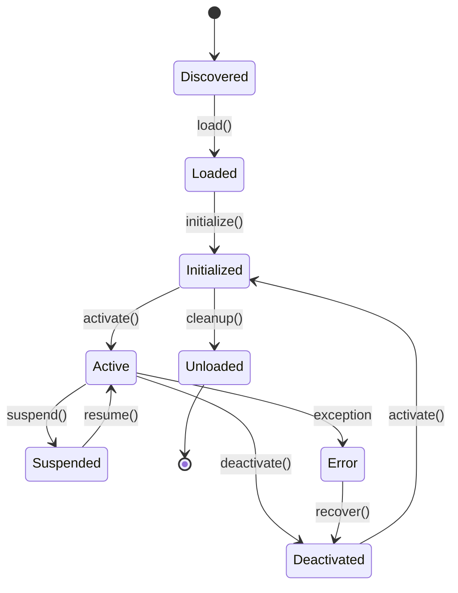

# Akasha Plugin Architecture

## Table of Contents
1. [Overview](#1-overview)
2. [Plugin System Design](#2-plugin-system-design)
3. [Plugin Types](#3-plugin-types)
4. [Plugin Development](#4-plugin-development)
5. [Plugin Lifecycle](#5-plugin-lifecycle)
6. [Security Model](#6-security-model)
7. [Plugin Registry](#7-plugin-registry)
8. [Configuration System](#8-configuration-system)
9. [Testing Framework](#9-testing-framework)
10. [Plugin Examples](#10-plugin-examples)
11. [Distribution and Packaging](#11-distribution-and-packaging)
12. [Best Practices](#12-best-practices)

---

## 1. Overview

The Akasha Plugin Architecture provides a flexible, secure, and extensible framework for adding custom functionality to the system. The architecture enables developers to create plugins for document processing, embedding models, LLMs, search enhancements, and user interface extensions while maintaining system stability and security.

### 1.1 Design Principles

- **Modularity**: Plugins are self-contained modules with clear interfaces
- **Security**: Sandboxed execution with resource limits and permission controls
- **Performance**: Minimal overhead with efficient loading and execution
- **Compatibility**: Version-aware plugin system with backwards compatibility
- **Extensibility**: Multiple plugin types supporting different extension points
- **Community**: Easy development, distribution, and management

### 1.2 Key Features

- Dynamic plugin loading and unloading
- Sandboxed execution environment
- Resource monitoring and limits
- Plugin marketplace and registry
- Hot-reloading for development
- Comprehensive configuration system
- Automated testing framework

---

## 2. Plugin System Design

### 2.1 Architecture Overview

```
┌─────────────────────────────────────────────────────────────────┐
│                        Akasha Core System                      │
├─────────────────────────────────────────────────────────────────┤
│  ┌─────────────┐  ┌─────────────┐  ┌─────────────┐            │
│  │   Plugin    │  │   Plugin    │  │   Security  │            │
│  │  Manager    │  │  Registry   │  │  Sandbox    │            │
│  └─────────────┘  └─────────────┘  └─────────────┘            │
├─────────────────────────────────────────────────────────────────┤
│  ┌─────────────┐  ┌─────────────┐  ┌─────────────┐            │
│  │ Document    │  │ Embedding   │  │    LLM      │            │
│  │ Processors  │  │   Models    │  │  Plugins    │            │
│  └─────────────┘  └─────────────┘  └─────────────┘            │
├─────────────────────────────────────────────────────────────────┤
│  ┌─────────────┐  ┌─────────────┐  ┌─────────────┐            │
│  │   Search    │  │     UI      │  │   Custom    │            │
│  │ Enhancers   │  │ Extensions  │  │  Plugins    │            │
│  └─────────────┘  └─────────────┘  └─────────────┘            │
└─────────────────────────────────────────────────────────────────┘
```

### 2.2 Core Components

#### 2.2.1 Plugin Manager
- Central orchestrator for all plugin operations
- Manages plugin lifecycle (load, activate, deactivate, unload)
- Handles plugin dependencies and conflicts
- Provides plugin discovery and registry integration

#### 2.2.2 Plugin Registry
- Maintains catalog of available plugins
- Handles plugin metadata and versioning
- Provides search and filtering capabilities
- Manages plugin ratings and reviews

#### 2.2.3 Security Sandbox
- Isolates plugin execution from core system
- Enforces resource limits and permissions
- Monitors plugin behavior and performance
- Provides secure communication channels

#### 2.2.4 Configuration System
- Manages plugin-specific configurations
- Provides validation and schema enforcement
- Handles configuration inheritance and overrides
- Supports dynamic configuration updates

---

## 3. Plugin Types

### 3.1 Document Processor Plugins

**Purpose**: Extend document ingestion capabilities with new file formats or enhanced processing

**Interface**:
```python
from akasha.plugins import DocumentProcessorPlugin
from typing import List, Dict, Optional

class CustomDocumentProcessor(DocumentProcessorPlugin):
    @property
    def metadata(self) -> PluginMetadata:
        return PluginMetadata(
            name="custom-processor",
            version="1.0.0",
            description="Custom document processor for specialized formats",
            author="Developer Name",
            dependencies=["pillow>=8.0.0"],
            categories=["document-processor"],
            api_version="1.0",
            entry_point="custom_processor"
        )
    
    def supported_formats(self) -> List[str]:
        """Return list of supported file formats"""
        return [".xyz", ".custom"]
    
    async def process_document(self, 
                              document_data: bytes, 
                              metadata: Dict) -> ProcessedDocument:
        """Process document and extract content"""
        # Custom processing logic
        pass
    
    async def extract_metadata(self, document_data: bytes) -> Dict:
        """Extract document metadata"""
        pass
    
    async def validate_document(self, document_data: bytes) -> bool:
        """Validate document format"""
        pass
```

**Use Cases**:
- Custom file format support (CAD files, scientific data formats)
- Enhanced OCR for specific document types
- Specialized metadata extraction
- Domain-specific content analysis

### 3.2 Embedding Model Plugins

**Purpose**: Add support for new embedding models or enhance existing ones

**Interface**:
```python
from akasha.plugins import EmbeddingModelPlugin
import numpy as np

class CustomEmbeddingModel(EmbeddingModelPlugin):
    @property
    def metadata(self) -> PluginMetadata:
        return PluginMetadata(
            name="custom-embeddings",
            version="1.0.0",
            description="Custom embedding model for domain-specific content",
            author="Developer Name",
            dependencies=["torch>=1.9.0", "transformers>=4.0.0"],
            categories=["embedding-model"],
            api_version="1.0",
            entry_point="custom_embeddings"
        )
    
    def get_dimensions(self) -> int:
        """Return embedding dimensions"""
        return 768
    
    async def embed_text(self, text: str) -> np.ndarray:
        """Generate text embeddings"""
        pass
    
    async def embed_image(self, image: bytes) -> np.ndarray:
        """Generate image embeddings"""
        pass
    
    async def embed_multimodal(self, content: Dict) -> np.ndarray:
        """Generate multimodal embeddings"""
        pass
    
    def get_supported_modalities(self) -> List[str]:
        """Return supported content modalities"""
        return ["text", "image"]
```

**Use Cases**:
- Domain-specific embedding models (legal, medical, scientific)
- Multilingual embedding models
- Custom multimodal embedding approaches
- Optimized models for specific hardware

### 3.3 LLM Plugins

**Purpose**: Integrate new language models or enhance generation capabilities

**Interface**:
```python
from akasha.plugins import LLMPlugin
from typing import AsyncGenerator

class CustomLLMPlugin(LLMPlugin):
    @property
    def metadata(self) -> PluginMetadata:
        return PluginMetadata(
            name="custom-llm",
            version="1.0.0",
            description="Custom LLM with specialized capabilities",
            author="Developer Name",
            dependencies=["transformers>=4.0.0"],
            categories=["llm"],
            api_version="1.0",
            entry_point="custom_llm"
        )
    
    async def generate(self, prompt: str, config: Dict) -> str:
        """Generate text response"""
        pass
    
    async def generate_stream(self, 
                             prompt: str, 
                             config: Dict) -> AsyncGenerator[str, None]:
        """Generate streaming text response"""
        async for chunk in self._stream_generation(prompt, config):
            yield chunk
    
    def get_capabilities(self) -> List[str]:
        """Return model capabilities"""
        return ["text-generation", "chat", "reasoning"]
    
    def get_context_window(self) -> int:
        """Return maximum context window size"""
        return 4096
```

**Use Cases**:
- Specialized models for specific domains
- Custom prompt templates and techniques
- Model ensembles and routing
- Hardware-specific optimizations

### 3.4 Search Enhancement Plugins

**Purpose**: Extend search capabilities with new algorithms or techniques

**Interface**:
```python
from akasha.plugins import SearchEnhancerPlugin

class CustomSearchEnhancer(SearchEnhancerPlugin):
    @property
    def metadata(self) -> PluginMetadata:
        return PluginMetadata(
            name="advanced-search",
            version="1.0.0",
            description="Advanced search with custom ranking",
            author="Developer Name",
            dependencies=["scikit-learn>=1.0.0"],
            categories=["search-enhancer"],
            api_version="1.0",
            entry_point="advanced_search"
        )
    
    async def enhance_query(self, query: str, context: Dict) -> str:
        """Enhance search query"""
        pass
    
    async def rerank_results(self, 
                            query: str, 
                            results: List[SearchResult]) -> List[SearchResult]:
        """Rerank search results"""
        pass
    
    async def suggest_queries(self, query: str) -> List[str]:
        """Suggest related queries"""
        pass
```

**Use Cases**:
- Custom ranking algorithms
- Query expansion techniques
- Personalization features
- Domain-specific search logic

### 3.5 UI Extension Plugins

**Purpose**: Add custom user interface components and features

**Interface**:
```python
from akasha.plugins import UIExtensionPlugin

class CustomUIExtension(UIExtensionPlugin):
    @property
    def metadata(self) -> PluginMetadata:
        return PluginMetadata(
            name="visualization-extension",
            version="1.0.0",
            description="Custom data visualization components",
            author="Developer Name",
            dependencies=["react>=17.0.0"],
            categories=["ui-extension"],
            api_version="1.0",
            entry_point="visualization_extension"
        )
    
    def get_components(self) -> Dict[str, str]:
        """Return React component definitions"""
        return {
            "DataVisualization": "path/to/component.js",
            "CustomChart": "path/to/chart.js"
        }
    
    def get_routes(self) -> List[Dict]:
        """Return additional routes"""
        return [
            {"path": "/visualize", "component": "DataVisualization"}
        ]
    
    def get_menu_items(self) -> List[Dict]:
        """Return menu items to add"""
        return [
            {"label": "Visualizations", "path": "/visualize", "icon": "chart"}
        ]
```

**Use Cases**:
- Custom visualization components
- Domain-specific interfaces
- Integration with external tools
- Workflow automation interfaces

---

## 4. Plugin Development

### 4.1 Development Environment Setup

#### 4.1.1 Plugin SDK Installation
```bash
# Install the Akasha Plugin SDK
pip install akasha-plugin-sdk

# Create new plugin from template
akasha-cli create-plugin --name my-plugin --type document-processor

# Plugin development tools
akasha-cli dev-server --hot-reload
```

#### 4.1.2 Project Structure
```
my-plugin/
├── plugin.yaml           # Plugin metadata and configuration
├── src/
│   ├── __init__.py       # Plugin entry point
│   ├── processor.py      # Main plugin implementation
│   └── utils.py          # Utility functions
├── tests/
│   ├── test_processor.py # Unit tests
│   └── fixtures/         # Test data
├── docs/
│   ├── README.md         # Plugin documentation
│   └── examples.md       # Usage examples
├── requirements.txt      # Dependencies
└── setup.py             # Package configuration
```

### 4.2 Plugin Metadata (plugin.yaml)

```yaml
metadata:
  name: "my-document-processor"
  version: "1.0.0"
  description: "Custom document processor for XYZ format"
  author: "Developer Name"
  email: "dev@example.com"
  license: "MIT"
  homepage: "https://github.com/developer/my-plugin"
  repository: "https://github.com/developer/my-plugin.git"
  
  # Plugin classification
  categories:
    - "document-processor"
  tags:
    - "pdf"
    - "ocr"
    - "custom-format"
  
  # API compatibility
  api_version: "1.0"
  min_akasha_version: "1.0.0"
  max_akasha_version: "2.0.0"
  
  # Dependencies
  dependencies:
    - "pillow>=8.0.0"
    - "pandas>=1.3.0"
  
  # Entry point
  entry_point: "my_plugin.processor"
  main_class: "CustomDocumentProcessor"

# Plugin configuration schema
config_schema:
  type: "object"
  properties:
    ocr_engine:
      type: "string"
      enum: ["tesseract", "paddleocr", "easyocr"]
      default: "tesseract"
    enable_tables:
      type: "boolean"
      default: true
    batch_size:
      type: "integer"
      minimum: 1
      maximum: 100
      default: 10
  required: ["ocr_engine"]

# Resource requirements
resources:
  memory_mb: 512
  cpu_cores: 1
  gpu_memory_mb: 0
  
# Security permissions
permissions:
  file_access:
    - "read"
  network_access: false
  system_calls: []
  
# Supported platforms
platforms:
  - "linux"
  - "macos"
  - "windows"
```

### 4.3 Plugin Implementation

#### 4.3.1 Basic Plugin Structure
```python
# src/__init__.py
from .processor import CustomDocumentProcessor

__version__ = "1.0.0"
__plugin_class__ = CustomDocumentProcessor
```

```python
# src/processor.py
import asyncio
from typing import List, Dict, Optional
from akasha.plugins import DocumentProcessorPlugin, PluginMetadata
from akasha.types import ProcessedDocument, ContentSegment

class CustomDocumentProcessor(DocumentProcessorPlugin):
    def __init__(self):
        super().__init__()
        self.config = None
        self.model = None
    
    @property
    def metadata(self) -> PluginMetadata:
        return PluginMetadata(
            name="my-document-processor",
            version="1.0.0",
            description="Custom document processor for XYZ format",
            author="Developer Name",
            dependencies=["pillow>=8.0.0"],
            categories=["document-processor"],
            api_version="1.0",
            entry_point="my_plugin.processor"
        )
    
    async def initialize(self, config: Dict) -> bool:
        """Initialize the plugin with configuration"""
        try:
            self.config = config
            
            # Load any required models or resources
            await self._load_models()
            
            # Validate configuration
            self._validate_config(config)
            
            return True
        except Exception as e:
            self.logger.error(f"Failed to initialize plugin: {e}")
            return False
    
    async def cleanup(self) -> bool:
        """Cleanup resources when plugin is deactivated"""
        try:
            if self.model:
                await self._unload_models()
            return True
        except Exception as e:
            self.logger.error(f"Failed to cleanup plugin: {e}")
            return False
    
    def supported_formats(self) -> List[str]:
        """Return list of supported file formats"""
        return [".xyz", ".custom"]
    
    async def process_document(self, 
                              document_data: bytes, 
                              metadata: Dict) -> ProcessedDocument:
        """Process document and extract content"""
        try:
            # Validate document format
            if not await self.validate_document(document_data):
                raise ValueError("Invalid document format")
            
            # Extract content
            segments = await self._extract_content(document_data)
            
            # Extract metadata
            doc_metadata = await self.extract_metadata(document_data)
            
            # Create processed document
            return ProcessedDocument(
                document_id=metadata.get("document_id"),
                original_filename=metadata.get("filename"),
                metadata=doc_metadata,
                segments=segments,
                processing_stats=self._get_processing_stats()
            )
            
        except Exception as e:
            self.logger.error(f"Failed to process document: {e}")
            raise
    
    async def extract_metadata(self, document_data: bytes) -> Dict:
        """Extract document metadata"""
        # Custom metadata extraction logic
        return {
            "format": "xyz",
            "version": "1.0",
            "page_count": 1,
            "created_by": "Custom Processor"
        }
    
    async def validate_document(self, document_data: bytes) -> bool:
        """Validate document format"""
        # Check magic bytes or format signatures
        return document_data.startswith(b"XYZ")
    
    async def get_info(self) -> Dict:
        """Get plugin information"""
        return {
            "status": "active",
            "processed_documents": getattr(self, "_processed_count", 0),
            "configuration": self.config
        }
    
    # Private methods
    async def _load_models(self):
        """Load required models or resources"""
        # Load any ML models, libraries, etc.
        pass
    
    async def _unload_models(self):
        """Unload models and free resources"""
        pass
    
    async def _extract_content(self, document_data: bytes) -> List[ContentSegment]:
        """Extract content segments from document"""
        segments = []
        
        # Custom content extraction logic
        # This would vary based on the document format
        
        segment = ContentSegment(
            id="seg_001",
            type="text",
            content="Extracted text content",
            metadata={},
            page_number=1,
            order_index=0
        )
        segments.append(segment)
        
        return segments
    
    def _validate_config(self, config: Dict):
        """Validate plugin configuration"""
        required_keys = ["ocr_engine"]
        for key in required_keys:
            if key not in config:
                raise ValueError(f"Missing required configuration: {key}")
    
    def _get_processing_stats(self) -> Dict:
        """Get processing statistics"""
        return {
            "processing_time": 1.5,
            "segments_extracted": 1,
            "images_extracted": 0,
            "tables_extracted": 0
        }
```

### 4.4 Testing Framework

#### 4.4.1 Unit Tests
```python
# tests/test_processor.py
import pytest
import asyncio
from src.processor import CustomDocumentProcessor

class TestCustomDocumentProcessor:
    @pytest.fixture
    def processor(self):
        return CustomDocumentProcessor()
    
    @pytest.fixture
    def sample_config(self):
        return {
            "ocr_engine": "tesseract",
            "enable_tables": True,
            "batch_size": 10
        }
    
    @pytest.fixture
    def sample_document(self):
        return b"XYZ\x00\x01\x02Sample document content"
    
    @pytest.mark.asyncio
    async def test_initialization(self, processor, sample_config):
        """Test plugin initialization"""
        result = await processor.initialize(sample_config)
        assert result is True
        assert processor.config == sample_config
    
    @pytest.mark.asyncio
    async def test_document_validation(self, processor, sample_document):
        """Test document validation"""
        await processor.initialize({"ocr_engine": "tesseract"})
        
        # Valid document
        result = await processor.validate_document(sample_document)
        assert result is True
        
        # Invalid document
        result = await processor.validate_document(b"Invalid data")
        assert result is False
    
    @pytest.mark.asyncio
    async def test_document_processing(self, processor, sample_document):
        """Test document processing"""
        await processor.initialize({"ocr_engine": "tesseract"})
        
        metadata = {
            "document_id": "test_doc_001",
            "filename": "test.xyz"
        }
        
        result = await processor.process_document(sample_document, metadata)
        
        assert result.document_id == "test_doc_001"
        assert result.original_filename == "test.xyz"
        assert len(result.segments) > 0
        assert result.segments[0].type == "text"
    
    def test_supported_formats(self, processor):
        """Test supported formats"""
        formats = processor.supported_formats()
        assert ".xyz" in formats
        assert ".custom" in formats
    
    @pytest.mark.asyncio
    async def test_cleanup(self, processor, sample_config):
        """Test plugin cleanup"""
        await processor.initialize(sample_config)
        result = await processor.cleanup()
        assert result is True
```

#### 4.4.2 Integration Tests
```python
# tests/test_integration.py
import pytest
from akasha.core import AkashaSystem
from src.processor import CustomDocumentProcessor

class TestPluginIntegration:
    @pytest.fixture
    async def system(self):
        """Create Akasha system for testing"""
        system = AkashaSystem(config_path="test_config.yaml")
        await system.initialize()
        return system
    
    @pytest.mark.asyncio
    async def test_plugin_registration(self, system):
        """Test plugin registration with system"""
        plugin = CustomDocumentProcessor()
        
        # Register plugin
        success = await system.plugin_manager.register_plugin(plugin)
        assert success is True
        
        # Verify plugin is available
        available_plugins = system.plugin_manager.list_plugins()
        plugin_names = [p.name for p in available_plugins]
        assert "my-document-processor" in plugin_names
    
    @pytest.mark.asyncio
    async def test_document_processing_pipeline(self, system):
        """Test end-to-end document processing"""
        # Register and activate plugin
        plugin = CustomDocumentProcessor()
        await system.plugin_manager.register_plugin(plugin)
        await system.plugin_manager.activate_plugin("my-document-processor")
        
        # Process document through system
        with open("tests/fixtures/sample.xyz", "rb") as f:
            document_data = f.read()
        
        result = await system.ingestion_engine.process_document(
            document_data,
            {"filename": "sample.xyz"}
        )
        
        assert result.status == "processed"
        assert len(result.segments) > 0
```

---

## 5. Plugin Lifecycle

### 5.1 Lifecycle States



### 5.2 Lifecycle Events

```python
class PluginLifecycleManager:
    async def load_plugin(self, plugin_path: str) -> bool:
        """Load plugin from path"""
        try:
            # Discover plugin
            plugin_info = await self._discover_plugin(plugin_path)
            
            # Validate plugin
            await self._validate_plugin(plugin_info)
            
            # Load plugin module
            plugin_module = await self._load_module(plugin_path)
            
            # Create plugin instance
            plugin_instance = plugin_module.__plugin_class__()
            
            # Register plugin
            await self.registry.register_plugin(plugin_instance)
            
            # Emit event
            await self._emit_event("plugin.loaded", plugin_info)
            
            return True
        except Exception as e:
            await self._emit_event("plugin.load_failed", {"error": str(e)})
            return False
    
    async def activate_plugin(self, plugin_name: str, config: Dict = None) -> bool:
        """Activate plugin with configuration"""
        try:
            plugin = self.registry.get_plugin(plugin_name)
            if not plugin:
                raise ValueError(f"Plugin not found: {plugin_name}")
            
            # Initialize plugin
            success = await plugin.initialize(config or {})
            if not success:
                raise RuntimeError("Plugin initialization failed")
            
            # Add to active plugins
            self.active_plugins[plugin_name] = plugin
            
            # Setup monitoring
            await self._setup_monitoring(plugin_name)
            
            # Emit event
            await self._emit_event("plugin.activated", {"name": plugin_name})
            
            return True
        except Exception as e:
            await self._emit_event("plugin.activation_failed", {
                "name": plugin_name,
                "error": str(e)
            })
            return False
    
    async def deactivate_plugin(self, plugin_name: str) -> bool:
        """Deactivate plugin"""
        try:
            plugin = self.active_plugins.get(plugin_name)
            if not plugin:
                return True  # Already deactivated
            
            # Cleanup plugin
            await plugin.cleanup()
            
            # Remove from active plugins
            del self.active_plugins[plugin_name]
            
            # Stop monitoring
            await self._stop_monitoring(plugin_name)
            
            # Emit event
            await self._emit_event("plugin.deactivated", {"name": plugin_name})
            
            return True
        except Exception as e:
            await self._emit_event("plugin.deactivation_failed", {
                "name": plugin_name,
                "error": str(e)
            })
            return False
```

### 5.3 Hot Reloading

```python
class HotReloadManager:
    def __init__(self, plugin_manager):
        self.plugin_manager = plugin_manager
        self.file_watchers = {}
    
    async def enable_hot_reload(self, plugin_name: str):
        """Enable hot reloading for plugin"""
        plugin_path = self._get_plugin_path(plugin_name)
        
        # Setup file watcher
        watcher = FileWatcher(plugin_path)
        watcher.on_change = lambda: self._reload_plugin(plugin_name)
        
        self.file_watchers[plugin_name] = watcher
        await watcher.start()
    
    async def _reload_plugin(self, plugin_name: str):
        """Reload plugin when files change"""
        try:
            # Get current configuration
            config = await self._get_plugin_config(plugin_name)
            
            # Deactivate current plugin
            await self.plugin_manager.deactivate_plugin(plugin_name)
            
            # Reload plugin module
            await self._reload_module(plugin_name)
            
            # Reactivate plugin
            await self.plugin_manager.activate_plugin(plugin_name, config)
            
            print(f"Hot reloaded plugin: {plugin_name}")
            
        except Exception as e:
            print(f"Hot reload failed for {plugin_name}: {e}")
```

---

## 6. Security Model

### 6.1 Sandbox Architecture

```python
class PluginSandbox:
    def __init__(self, config: Dict):
        self.config = config
        self.resource_monitor = ResourceMonitor()
        self.permission_manager = PermissionManager()
    
    async def execute_plugin_method(self, 
                                  plugin: PluginInterface,
                                  method_name: str,
                                  *args, **kwargs) -> Any:
        """Execute plugin method in sandbox"""
        
        # Check permissions
        if not self.permission_manager.check_permission(plugin, method_name):
            raise PermissionError(f"Plugin lacks permission for {method_name}")
        
        # Set resource limits
        limits = self._get_resource_limits(plugin)
        await self.resource_monitor.set_limits(limits)
        
        try:
            # Execute with timeout
            timeout = limits.get("execution_timeout", 30)
            
            result = await asyncio.wait_for(
                self._safe_execute(plugin, method_name, *args, **kwargs),
                timeout=timeout
            )
            
            return result
            
        except asyncio.TimeoutError:
            raise PluginExecutionError(f"Plugin method {method_name} timed out")
        except MemoryError:
            raise PluginExecutionError(f"Plugin method {method_name} exceeded memory limit")
        except Exception as e:
            raise PluginExecutionError(f"Plugin method {method_name} failed: {str(e)}")
        finally:
            await self.resource_monitor.reset_limits()
    
    async def _safe_execute(self, plugin, method_name, *args, **kwargs):
        """Safely execute plugin method with monitoring"""
        method = getattr(plugin, method_name)
        
        # Start monitoring
        monitor_task = asyncio.create_task(
            self.resource_monitor.monitor_execution(plugin)
        )
        
        try:
            # Execute method
            if asyncio.iscoroutinefunction(method):
                result = await method(*args, **kwargs)
            else:
                result = method(*args, **kwargs)
            
            return result
        finally:
            monitor_task.cancel()
```

### 6.2 Permission System

```python
class PermissionManager:
    def __init__(self):
        self.permissions = {
            "file_access": {
                "read": ["document_data", "config_files"],
                "write": ["output_files", "cache"],
                "delete": []
            },
            "network_access": {
                "outbound": ["api_calls"],
                "inbound": []
            },
            "system_calls": {
                "allowed": ["os.path", "os.environ.get"],
                "blocked": ["os.system", "subprocess.call"]
            },
            "resource_access": {
                "memory_mb": 512,
                "cpu_cores": 1,
                "gpu_memory_mb": 0
            }
        }
    
    def check_permission(self, plugin: PluginInterface, operation: str) -> bool:
        """Check if plugin has permission for operation"""
        plugin_permissions = plugin.metadata.permissions
        
        # Check specific operation permissions
        if operation in plugin_permissions:
            return plugin_permissions[operation]
        
        # Check category permissions
        category = self._get_operation_category(operation)
        if category in plugin_permissions:
            return operation in plugin_permissions[category]
        
        return False
    
    def grant_permission(self, plugin_name: str, permission: str):
        """Grant permission to plugin"""
        # Implementation for dynamic permission granting
        pass
    
    def revoke_permission(self, plugin_name: str, permission: str):
        """Revoke permission from plugin"""
        # Implementation for permission revocation
        pass
```

### 6.3 Resource Monitoring

```python
class ResourceMonitor:
    def __init__(self):
        self.active_monitors = {}
        self.limits = {}
    
    async def set_limits(self, limits: Dict):
        """Set resource limits for current execution"""
        self.limits = limits
    
    async def monitor_execution(self, plugin: PluginInterface):
        """Monitor plugin resource usage during execution"""
        plugin_name = plugin.metadata.name
        
        monitor = ResourceUsageMonitor(plugin_name)
        self.active_monitors[plugin_name] = monitor
        
        try:
            while True:
                usage = await monitor.get_current_usage()
                
                # Check memory limit
                if usage["memory_mb"] > self.limits.get("memory_mb", 512):
                    raise MemoryError(f"Plugin exceeded memory limit: {usage['memory_mb']}MB")
                
                # Check CPU limit
                if usage["cpu_percent"] > self.limits.get("cpu_percent", 50):
                    print(f"Warning: Plugin using high CPU: {usage['cpu_percent']}%")
                
                await asyncio.sleep(0.1)  # Monitor every 100ms
                
        except asyncio.CancelledError:
            pass
        finally:
            if plugin_name in self.active_monitors:
                del self.active_monitors[plugin_name]
```

---

## 7. Plugin Registry

### 7.1 Registry Structure

```python
class PluginRegistry:
    def __init__(self, registry_url: str = None):
        self.registry_url = registry_url or "https://registry.akasha.ai"
        self.local_cache = LocalPluginCache()
        self.metadata_store = PluginMetadataStore()
    
    async def search_plugins(self, 
                           query: str = None,
                           category: str = None,
                           tags: List[str] = None,
                           author: str = None) -> List[PluginInfo]:
        """Search for plugins in registry"""
        params = {
            "query": query,
            "category": category,
            "tags": tags,
            "author": author
        }
        
        # Remove None values
        params = {k: v for k, v in params.items() if v is not None}
        
        response = await self._api_request("GET", "/plugins/search", params=params)
        
        return [PluginInfo(**plugin_data) for plugin_data in response["plugins"]]
    
    async def get_plugin_info(self, plugin_name: str, version: str = None) -> PluginInfo:
        """Get detailed plugin information"""
        url = f"/plugins/{plugin_name}"
        if version:
            url += f"/{version}"
        
        response = await self._api_request("GET", url)
        return PluginInfo(**response)
    
    async def download_plugin(self, plugin_name: str, version: str = None) -> str:
        """Download plugin package"""
        # Check local cache first
        cached_path = await self.local_cache.get_plugin(plugin_name, version)
        if cached_path:
            return cached_path
        
        # Download from registry
        download_url = await self._get_download_url(plugin_name, version)
        plugin_path = await self._download_file(download_url)
        
        # Cache locally
        await self.local_cache.store_plugin(plugin_name, version, plugin_path)
        
        return plugin_path
    
    async def publish_plugin(self, plugin_path: str, metadata: Dict) -> bool:
        """Publish plugin to registry"""
        # Validate plugin
        await self._validate_plugin_package(plugin_path)
        
        # Upload plugin package
        upload_url = await self._request_upload_url(metadata)
        await self._upload_file(plugin_path, upload_url)
        
        # Submit metadata
        await self._api_request("POST", "/plugins", data=metadata)
        
        return True
    
    async def rate_plugin(self, plugin_name: str, rating: int, review: str = None):
        """Rate and review plugin"""
        data = {
            "rating": rating,
            "review": review
        }
        
        await self._api_request("POST", f"/plugins/{plugin_name}/rate", data=data)
```

### 7.2 Plugin Marketplace

```python
class PluginMarketplace:
    def __init__(self, registry: PluginRegistry):
        self.registry = registry
        self.installation_manager = PluginInstallationManager()
    
    async def browse_plugins(self, 
                           category: str = None,
                           sort_by: str = "popularity",
                           page: int = 1,
                           per_page: int = 20) -> Dict:
        """Browse plugins in marketplace"""
        plugins = await self.registry.search_plugins(category=category)
        
        # Sort plugins
        if sort_by == "popularity":
            plugins.sort(key=lambda p: p.download_count, reverse=True)
        elif sort_by == "rating":
            plugins.sort(key=lambda p: p.average_rating, reverse=True)
        elif sort_by == "newest":
            plugins.sort(key=lambda p: p.created_at, reverse=True)
        
        # Paginate
        start = (page - 1) * per_page
        end = start + per_page
        page_plugins = plugins[start:end]
        
        return {
            "plugins": page_plugins,
            "total": len(plugins),
            "page": page,
            "per_page": per_page,
            "total_pages": (len(plugins) + per_page - 1) // per_page
        }
    
    async def install_plugin(self, 
                           plugin_name: str, 
                           version: str = None,
                           config: Dict = None) -> bool:
        """Install plugin from marketplace"""
        try:
            # Download plugin
            plugin_path = await self.registry.download_plugin(plugin_name, version)
            
            # Install plugin
            success = await self.installation_manager.install(plugin_path)
            
            if success and config:
                # Configure plugin
                await self.installation_manager.configure(plugin_name, config)
            
            return success
            
        except Exception as e:
            print(f"Failed to install plugin {plugin_name}: {e}")
            return False
    
    async def update_plugin(self, plugin_name: str) -> bool:
        """Update plugin to latest version"""
        try:
            # Check for updates
            current_version = await self._get_installed_version(plugin_name)
            latest_version = await self._get_latest_version(plugin_name)
            
            if current_version >= latest_version:
                return True  # Already up to date
            
            # Backup current configuration
            config = await self._backup_config(plugin_name)
            
            # Uninstall current version
            await self.installation_manager.uninstall(plugin_name)
            
            # Install latest version
            success = await self.install_plugin(plugin_name, latest_version, config)
            
            return success
            
        except Exception as e:
            print(f"Failed to update plugin {plugin_name}: {e}")
            return False
```

---

## 8. Configuration System

### 8.1 Configuration Schema

```python
from pydantic import BaseModel, Field
from typing import Dict, List, Optional, Any

class PluginConfigSchema(BaseModel):
    """Base configuration schema for plugins"""
    
    class Config:
        extra = "forbid"  # Prevent additional fields
    
    # Plugin identification
    plugin_name: str = Field(..., description="Plugin name")
    version: str = Field(..., description="Plugin version")
    
    # Activation settings
    enabled: bool = Field(True, description="Whether plugin is enabled")
    auto_start: bool = Field(False, description="Auto-start plugin on system startup")
    priority: int = Field(0, description="Plugin priority (higher = loaded first)")
    
    # Resource limits
    max_memory_mb: int = Field(512, ge=1, le=8192, description="Maximum memory usage")
    max_cpu_percent: int = Field(50, ge=1, le=100, description="Maximum CPU usage")
    timeout_seconds: int = Field(30, ge=1, le=300, description="Execution timeout")
    
    # Plugin-specific configuration
    config: Dict[str, Any] = Field(default_factory=dict, description="Plugin-specific settings")

class DocumentProcessorConfig(PluginConfigSchema):
    """Configuration for document processor plugins"""
    
    # Processing settings
    batch_size: int = Field(10, ge=1, le=100, description="Batch processing size")
    max_file_size_mb: int = Field(100, ge=1, le=1000, description="Maximum file size")
    supported_formats: List[str] = Field(default_factory=list, description="Supported file formats")
    
    # OCR settings
    ocr_enabled: bool = Field(True, description="Enable OCR processing")
    ocr_engine: str = Field("tesseract", description="OCR engine to use")
    ocr_languages: List[str] = Field(["en"], description="OCR languages")

class EmbeddingModelConfig(PluginConfigSchema):
    """Configuration for embedding model plugins"""
    
    # Model settings
    model_path: str = Field(..., description="Path to model files")
    device: str = Field("auto", description="Device for model inference")
    batch_size: int = Field(32, ge=1, le=256, description="Embedding batch size")
    
    # Performance settings
    use_cache: bool = Field(True, description="Cache embeddings")
    cache_size_mb: int = Field(1024, ge=64, le=8192, description="Cache size in MB")
```

### 8.2 Configuration Management

```python
class PluginConfigurationManager:
    def __init__(self, config_dir: str = "./config/plugins"):
        self.config_dir = Path(config_dir)
        self.config_dir.mkdir(parents=True, exist_ok=True)
        self.configs = {}
        self.watchers = {}
    
    async def load_plugin_config(self, plugin_name: str) -> PluginConfigSchema:
        """Load configuration for plugin"""
        config_file = self.config_dir / f"{plugin_name}.yaml"
        
        if not config_file.exists():
            # Create default configuration
            return await self._create_default_config(plugin_name)
        
        # Load from file
        with open(config_file, 'r') as f:
            config_data = yaml.safe_load(f)
        
        # Validate configuration
        schema_class = self._get_config_schema(plugin_name)
        config = schema_class(**config_data)
        
        self.configs[plugin_name] = config
        return config
    
    async def save_plugin_config(self, plugin_name: str, config: PluginConfigSchema):
        """Save plugin configuration"""
        config_file = self.config_dir / f"{plugin_name}.yaml"
        
        # Convert to dict and save
        config_dict = config.dict()
        
        with open(config_file, 'w') as f:
            yaml.dump(config_dict, f, default_flow_style=False)
        
        self.configs[plugin_name] = config
        
        # Notify watchers
        await self._notify_config_change(plugin_name, config)
    
    async def update_plugin_config(self, 
                                 plugin_name: str, 
                                 updates: Dict[str, Any]) -> PluginConfigSchema:
        """Update plugin configuration"""
        current_config = await self.load_plugin_config(plugin_name)
        
        # Merge updates
        config_dict = current_config.dict()
        config_dict.update(updates)
        
        # Validate updated configuration
        schema_class = self._get_config_schema(plugin_name)
        updated_config = schema_class(**config_dict)
        
        # Save updated configuration
        await self.save_plugin_config(plugin_name, updated_config)
        
        return updated_config
    
    def watch_config_changes(self, plugin_name: str, callback: callable):
        """Watch for configuration changes"""
        if plugin_name not in self.watchers:
            self.watchers[plugin_name] = []
        
        self.watchers[plugin_name].append(callback)
    
    async def _notify_config_change(self, plugin_name: str, config: PluginConfigSchema):
        """Notify watchers of configuration changes"""
        if plugin_name in self.watchers:
            for callback in self.watchers[plugin_name]:
                try:
                    if asyncio.iscoroutinefunction(callback):
                        await callback(config)
                    else:
                        callback(config)
                except Exception as e:
                    print(f"Config change notification failed: {e}")
```

---

## 9. Testing Framework

### 9.1 Plugin Testing Infrastructure

```python
class PluginTestFramework:
    def __init__(self):
        self.test_runner = PluginTestRunner()
        self.mock_system = MockAkashaSystem()
        self.fixture_manager = TestFixtureManager()
    
    async def run_plugin_tests(self, plugin_path: str) -> TestResults:
        """Run comprehensive tests for plugin"""
        results = TestResults()
        
        # Load plugin
        plugin = await self._load_plugin_for_testing(plugin_path)
        
        # Run different test categories
        results.unit_tests = await self._run_unit_tests(plugin)
        results.integration_tests = await self._run_integration_tests(plugin)
        results.performance_tests = await self._run_performance_tests(plugin)
        results.security_tests = await self._run_security_tests(plugin)
        
        return results
    
    async def _run_unit_tests(self, plugin) -> List[TestResult]:
        """Run unit tests for plugin"""
        test_cases = [
            self._test_plugin_initialization,
            self._test_plugin_methods,
            self._test_error_handling,
            self._test_configuration_validation
        ]
        
        results = []
        for test_case in test_cases:
            try:
                result = await test_case(plugin)
                results.append(TestResult(
                    name=test_case.__name__,
                    status="passed",
                    result=result
                ))
            except Exception as e:
                results.append(TestResult(
                    name=test_case.__name__,
                    status="failed",
                    error=str(e)
                ))
        
        return results
    
    async def _run_integration_tests(self, plugin) -> List[TestResult]:
        """Run integration tests with mock system"""
        # Register plugin with mock system
        await self.mock_system.plugin_manager.register_plugin(plugin)
        
        # Test plugin integration
        test_cases = [
            self._test_system_integration,
            self._test_data_flow,
            self._test_event_handling
        ]
        
        results = []
        for test_case in test_cases:
            try:
                result = await test_case(plugin, self.mock_system)
                results.append(TestResult(
                    name=test_case.__name__,
                    status="passed",
                    result=result
                ))
            except Exception as e:
                results.append(TestResult(
                    name=test_case.__name__,
                    status="failed",
                    error=str(e)
                ))
        
        return results
    
    async def _run_performance_tests(self, plugin) -> List[TestResult]:
        """Run performance tests"""
        test_cases = [
            self._test_memory_usage,
            self._test_processing_speed,
            self._test_concurrent_execution
        ]
        
        results = []
        for test_case in test_cases:
            result = await test_case(plugin)
            results.append(result)
        
        return results
    
    async def _run_security_tests(self, plugin) -> List[TestResult]:
        """Run security tests"""
        test_cases = [
            self._test_permission_enforcement,
            self._test_resource_limits,
            self._test_input_validation,
            self._test_sandbox_escape
        ]
        
        results = []
        for test_case in test_cases:
            result = await test_case(plugin)
            results.append(result)
        
        return results
```

### 9.2 Mock System for Testing

```python
class MockAkashaSystem:
    """Mock Akasha system for plugin testing"""
    
    def __init__(self):
        self.plugin_manager = MockPluginManager()
        self.ingestion_engine = MockIngestionEngine()
        self.embedding_service = MockEmbeddingService()
        self.vector_store = MockVectorStore()
    
    async def initialize(self):
        """Initialize mock system"""
        pass

class MockPluginManager:
    def __init__(self):
        self.plugins = {}
        self.active_plugins = {}
    
    async def register_plugin(self, plugin):
        self.plugins[plugin.metadata.name] = plugin
        return True
    
    async def activate_plugin(self, plugin_name, config=None):
        plugin = self.plugins.get(plugin_name)
        if plugin:
            await plugin.initialize(config or {})
            self.active_plugins[plugin_name] = plugin
            return True
        return False

class TestFixtureManager:
    """Manage test fixtures and data"""
    
    def __init__(self, fixtures_dir: str = "./tests/fixtures"):
        self.fixtures_dir = Path(fixtures_dir)
    
    def get_sample_document(self, format_type: str) -> bytes:
        """Get sample document for testing"""
        fixture_file = self.fixtures_dir / f"sample.{format_type}"
        if fixture_file.exists():
            return fixture_file.read_bytes()
        else:
            return self._generate_sample_document(format_type)
    
    def get_test_config(self, plugin_type: str) -> Dict:
        """Get test configuration for plugin type"""
        config_file = self.fixtures_dir / f"config_{plugin_type}.yaml"
        if config_file.exists():
            with open(config_file, 'r') as f:
                return yaml.safe_load(f)
        else:
            return self._generate_test_config(plugin_type)
```

---

## 10. Plugin Examples

### 10.1 PDF Processor Plugin

```python
# Example: Enhanced PDF processor with OCR
class EnhancedPDFProcessor(DocumentProcessorPlugin):
    @property
    def metadata(self) -> PluginMetadata:
        return PluginMetadata(
            name="enhanced-pdf-processor",
            version="1.0.0",
            description="PDF processor with advanced OCR and table extraction",
            author="Akasha Team",
            dependencies=["pymupdf>=1.20.0", "paddleocr>=2.6.0", "opencv-python>=4.5.0"],
            categories=["document-processor"],
            api_version="1.0",
            entry_point="enhanced_pdf"
        )
    
    async def initialize(self, config: Dict) -> bool:
        self.ocr_engine = self._init_ocr_engine(config.get("ocr_engine", "paddleocr"))
        self.table_detector = self._init_table_detector()
        return True
    
    def supported_formats(self) -> List[str]:
        return [".pdf"]
    
    async def process_document(self, document_data: bytes, metadata: Dict) -> ProcessedDocument:
        # Open PDF
        pdf_doc = fitz.open(stream=document_data, filetype="pdf")
        
        segments = []
        images = []
        
        for page_num in range(pdf_doc.page_count):
            page = pdf_doc[page_num]
            
            # Extract text
            text_segments = await self._extract_text_segments(page, page_num)
            segments.extend(text_segments)
            
            # Extract images
            page_images = await self._extract_images(page, page_num)
            segments.extend(page_images)
            images.extend(page_images)
            
            # Extract tables
            table_segments = await self._extract_tables(page, page_num)
            segments.extend(table_segments)
        
        pdf_doc.close()
        
        return ProcessedDocument(
            document_id=metadata.get("document_id"),
            original_filename=metadata.get("filename"),
            metadata=await self.extract_metadata(document_data),
            segments=segments,
            extracted_images=images,
            processing_stats=self._get_processing_stats()
        )
    
    async def _extract_text_segments(self, page, page_num: int) -> List[ContentSegment]:
        """Extract text with OCR fallback"""
        segments = []
        
        # Try text extraction first
        text_dict = page.get_text("dict")
        
        for block in text_dict["blocks"]:
            if "lines" in block:
                for line in block["lines"]:
                    text = " ".join([span["text"] for span in line["spans"]])
                    
                    if text.strip():
                        segment = ContentSegment(
                            id=f"text_{page_num}_{len(segments)}",
                            type="text",
                            content=text,
                            metadata={
                                "font": line["spans"][0].get("font", ""),
                                "size": line["spans"][0].get("size", 0),
                                "bbox": line["bbox"]
                            },
                            page_number=page_num + 1,
                            order_index=len(segments)
                        )
                        segments.append(segment)
        
        # OCR fallback for images/scanned text
        if len(segments) == 0:
            ocr_segments = await self._ocr_page(page, page_num)
            segments.extend(ocr_segments)
        
        return segments
```

### 10.2 Custom Embedding Plugin

```python
# Example: Domain-specific embedding model
class ScientificEmbeddingModel(EmbeddingModelPlugin):
    @property
    def metadata(self) -> PluginMetadata:
        return PluginMetadata(
            name="scientific-embeddings",
            version="1.0.0",
            description="Embedding model specialized for scientific literature",
            author="Research Team",
            dependencies=["torch>=1.9.0", "transformers>=4.0.0", "sentence-transformers>=2.0.0"],
            categories=["embedding-model"],
            api_version="1.0",
            entry_point="scientific_embeddings"
        )
    
    async def initialize(self, config: Dict) -> bool:
        from sentence_transformers import SentenceTransformer
        
        model_name = config.get("model_name", "allenai/scibert_scivocab_uncased")
        self.model = SentenceTransformer(model_name)
        self.device = config.get("device", "cpu")
        self.model.to(self.device)
        
        # Load scientific vocabulary enhancer
        self.vocab_enhancer = ScientificVocabularyEnhancer()
        
        return True
    
    def get_dimensions(self) -> int:
        return self.model.get_sentence_embedding_dimension()
    
    async def embed_text(self, text: str) -> np.ndarray:
        # Preprocess scientific text
        enhanced_text = await self.vocab_enhancer.enhance(text)
        
        # Generate embedding
        embedding = self.model.encode([enhanced_text], 
                                    convert_to_tensor=False,
                                    device=self.device)[0]
        
        return embedding
    
    async def embed_image(self, image: bytes) -> np.ndarray:
        # For scientific images, extract text via OCR first
        extracted_text = await self._extract_text_from_image(image)
        
        if extracted_text:
            return await self.embed_text(extracted_text)
        else:
            # Return zero vector for images without text
            return np.zeros(self.get_dimensions())
    
    def get_supported_modalities(self) -> List[str]:
        return ["text", "image"]

class ScientificVocabularyEnhancer:
    """Enhance scientific text with domain-specific preprocessing"""
    
    def __init__(self):
        self.abbreviations = self._load_scientific_abbreviations()
        self.terminology = self._load_scientific_terminology()
    
    async def enhance(self, text: str) -> str:
        # Expand abbreviations
        text = self._expand_abbreviations(text)
        
        # Normalize scientific terms
        text = self._normalize_terminology(text)
        
        # Handle mathematical expressions
        text = self._process_math_expressions(text)
        
        return text
```

### 10.3 Search Enhancement Plugin

```python
# Example: Citation-aware search enhancer
class CitationAwareSearchEnhancer(SearchEnhancerPlugin):
    @property
    def metadata(self) -> PluginMetadata:
        return PluginMetadata(
            name="citation-aware-search",
            version="1.0.0",
            description="Search enhancer that considers citation networks",
            author="Research Team",
            dependencies=["networkx>=2.6.0", "scikit-learn>=1.0.0"],
            categories=["search-enhancer"],
            api_version="1.0",
            entry_point="citation_search"
        )
    
    async def initialize(self, config: Dict) -> bool:
        self.citation_graph = CitationGraph()
        self.authority_ranker = AuthorityRanker()
        await self._build_citation_network()
        return True
    
    async def enhance_query(self, query: str, context: Dict) -> str:
        """Enhance query with related terms from citation network"""
        # Extract key terms from query
        key_terms = await self._extract_key_terms(query)
        
        # Find related terms in citation network
        related_terms = []
        for term in key_terms:
            related = await self.citation_graph.find_related_terms(term)
            related_terms.extend(related)
        
        # Construct enhanced query
        if related_terms:
            enhanced_query = f"{query} OR ({' OR '.join(related_terms)})"
            return enhanced_query
        
        return query
    
    async def rerank_results(self, 
                            query: str, 
                            results: List[SearchResult]) -> List[SearchResult]:
        """Rerank results based on citation authority and relevance"""
        
        for result in results:
            # Calculate citation authority score
            authority_score = await self.authority_ranker.calculate_authority(
                result.document.metadata.get("doi", "")
            )
            
            # Calculate topical relevance
            topical_score = await self._calculate_topical_relevance(
                query, result.document.content
            )
            
            # Combine scores
            result.score = (0.7 * result.score + 
                          0.2 * authority_score + 
                          0.1 * topical_score)
        
        # Sort by combined score
        results.sort(key=lambda r: r.score, reverse=True)
        
        return results
    
    async def suggest_queries(self, query: str) -> List[str]:
        """Suggest related queries based on citation patterns"""
        # Find papers related to query
        related_papers = await self._find_related_papers(query)
        
        # Extract common terms and phrases
        suggestions = []
        for paper in related_papers[:10]:  # Top 10 related papers
            terms = await self._extract_key_terms(paper.title + " " + paper.abstract)
            suggestions.extend(terms)
        
        # Remove duplicates and rank by frequency
        suggestion_counts = {}
        for term in suggestions:
            suggestion_counts[term] = suggestion_counts.get(term, 0) + 1
        
        # Return top suggestions
        top_suggestions = sorted(suggestion_counts.items(), 
                               key=lambda x: x[1], 
                               reverse=True)[:5]
        
        return [term for term, count in top_suggestions]

class CitationGraph:
    """Manages citation network and relationships"""
    
    def __init__(self):
        self.graph = nx.DiGraph()
        self.term_cooccurrence = {}
    
    async def find_related_terms(self, term: str) -> List[str]:
        """Find terms that co-occur with given term in citations"""
        if term in self.term_cooccurrence:
            related = self.term_cooccurrence[term]
            return sorted(related.items(), key=lambda x: x[1], reverse=True)[:5]
        return []
```

---

## 11. Distribution and Packaging

### 11.1 Plugin Package Structure

```
my-plugin-package/
├── setup.py                    # Package setup
├── pyproject.toml             # Modern Python packaging
├── plugin.yaml                # Plugin metadata
├── README.md                  # Documentation
├── LICENSE                    # License file
├── CHANGELOG.md              # Version history
├── src/
│   └── my_plugin/
│       ├── __init__.py       # Package init
│       ├── main.py           # Main plugin implementation
│       ├── models/           # ML models or data
│       └── utils/            # Utility functions
├── tests/
│   ├── __init__.py
│   ├── test_main.py
│   └── fixtures/
├── docs/
│   ├── installation.md
│   ├── configuration.md
│   └── examples.md
└── assets/
    ├── icon.png              # Plugin icon
    └── screenshots/          # UI screenshots
```

### 11.2 Setup Configuration

```python
# setup.py
from setuptools import setup, find_packages

setup(
    name="akasha-plugin-my-processor",
    version="1.0.0",
    description="Custom document processor for Akasha",
    long_description=open("README.md").read(),
    long_description_content_type="text/markdown",
    author="Developer Name",
    author_email="dev@example.com",
    url="https://github.com/developer/akasha-plugin-my-processor",
    packages=find_packages(where="src"),
    package_dir={"": "src"},
    package_data={
        "my_plugin": ["*.yaml", "models/*", "assets/*"]
    },
    install_requires=[
        "akasha-plugin-sdk>=1.0.0",
        "pillow>=8.0.0",
        "pandas>=1.3.0",
    ],
    extras_require={
        "dev": ["pytest>=6.0.0", "black>=21.0.0", "flake8>=3.9.0"],
        "gpu": ["torch>=1.9.0"],
    },
    python_requires=">=3.8",
    classifiers=[
        "Development Status :: 4 - Beta",
        "Intended Audience :: Developers",
        "License :: OSI Approved :: MIT License",
        "Programming Language :: Python :: 3",
        "Programming Language :: Python :: 3.8",
        "Programming Language :: Python :: 3.9",
        "Programming Language :: Python :: 3.10",
        "Topic :: Scientific/Engineering :: Artificial Intelligence",
    ],
    entry_points={
        "akasha.plugins": [
            "my-processor = my_plugin.main:CustomDocumentProcessor",
        ],
    },
)
```

```toml
# pyproject.toml
[build-system]
requires = ["setuptools>=45", "wheel", "setuptools_scm[toml]>=6.2"]
build-backend = "setuptools.build_meta"

[project]
name = "akasha-plugin-my-processor"
dynamic = ["version"]
description = "Custom document processor for Akasha"
readme = "README.md"
license = {text = "MIT"}
authors = [{name = "Developer Name", email = "dev@example.com"}]
classifiers = [
    "Development Status :: 4 - Beta",
    "Intended Audience :: Developers",
    "License :: OSI Approved :: MIT License",
    "Programming Language :: Python :: 3",
]
requires-python = ">=3.8"
dependencies = [
    "akasha-plugin-sdk>=1.0.0",
    "pillow>=8.0.0",
    "pandas>=1.3.0",
]

[project.optional-dependencies]
dev = ["pytest>=6.0.0", "black>=21.0.0", "flake8>=3.9.0"]
gpu = ["torch>=1.9.0"]

[project.urls]
Homepage = "https://github.com/developer/akasha-plugin-my-processor"
Repository = "https://github.com/developer/akasha-plugin-my-processor.git"
Documentation = "https://developer.github.io/akasha-plugin-my-processor"

[project.entry-points."akasha.plugins"]
my-processor = "my_plugin.main:CustomDocumentProcessor"
```

### 11.3 Publishing Workflow

```bash
#!/bin/bash
# publish.sh - Plugin publishing script

set -e

echo "Publishing Akasha plugin..."

# Version validation
if [ -z "$1" ]; then
    echo "Usage: $0 <version>"
    exit 1
fi

VERSION=$1

# Update version in setup.py and plugin.yaml
sed -i "s/version=\".*\"/version=\"$VERSION\"/" setup.py
sed -i "s/version:.*/version: \"$VERSION\"/" plugin.yaml

# Run tests
echo "Running tests..."
python -m pytest tests/

# Build package
echo "Building package..."
python setup.py sdist bdist_wheel

# Validate plugin
echo "Validating plugin..."
akasha-cli validate-plugin dist/akasha-plugin-my-processor-$VERSION.tar.gz

# Upload to PyPI
echo "Uploading to PyPI..."
twine upload dist/*

# Upload to Akasha Registry
echo "Uploading to Akasha Registry..."
akasha-cli publish-plugin \
    --package dist/akasha-plugin-my-processor-$VERSION.tar.gz \
    --metadata plugin.yaml \
    --token $AKASHA_REGISTRY_TOKEN

echo "Plugin published successfully!"
```

### 11.4 Installation Methods

#### 11.4.1 Via Package Manager
```bash
# Install from PyPI
pip install akasha-plugin-my-processor

# Install development version
pip install git+https://github.com/developer/akasha-plugin-my-processor.git

# Install with optional dependencies
pip install akasha-plugin-my-processor[gpu]
```

#### 11.4.2 Via Akasha CLI
```bash
# Install from registry
akasha plugin install my-processor

# Install specific version
akasha plugin install my-processor==1.0.0

# Install from local file
akasha plugin install ./my-plugin-package.tar.gz

# Install with configuration
akasha plugin install my-processor --config config.yaml
```

#### 11.4.3 Via API
```python
from akasha import AkashaClient

client = AkashaClient(api_key="your-key")

# Install plugin
result = client.plugins.install("my-processor", version="1.0.0")

# Configure plugin
config = {
    "ocr_engine": "paddleocr",
    "enable_tables": True
}
client.plugins.configure("my-processor", config)

# Activate plugin
client.plugins.activate("my-processor")
```

---

## 12. Best Practices

### 12.1 Development Best Practices

#### 12.1.1 Code Quality
- Follow PEP 8 style guidelines
- Use type hints for all public methods
- Write comprehensive docstrings
- Implement proper error handling
- Use logging instead of print statements

#### 12.1.2 Performance
- Implement async methods for I/O operations
- Use batch processing for multiple items
- Cache expensive computations
- Profile and optimize bottlenecks
- Respect resource limits

#### 12.1.3 Testing
- Write unit tests for all functionality
- Include integration tests with mock system
- Test error conditions and edge cases
- Validate configuration schemas
- Performance and load testing

### 12.2 Security Best Practices

#### 12.2.1 Input Validation
- Validate all user inputs
- Sanitize file paths and names
- Check file sizes and formats
- Prevent injection attacks

#### 12.2.2 Resource Management
- Respect memory and CPU limits
- Clean up resources properly
- Avoid infinite loops or recursion
- Handle large files efficiently

#### 12.2.3 Dependencies
- Pin dependency versions
- Audit dependencies for vulnerabilities
- Minimize dependency count
- Use virtual environments

### 12.3 Distribution Best Practices

#### 12.3.1 Documentation
- Provide clear installation instructions
- Document all configuration options
- Include usage examples
- Maintain changelog

#### 12.3.2 Versioning
- Follow semantic versioning
- Tag releases in git
- Maintain backwards compatibility
- Document breaking changes

#### 12.3.3 Community
- Respond to issues promptly
- Accept contributions
- Provide support channels
- Follow code of conduct

This comprehensive plugin architecture specification provides developers with everything needed to create, test, distribute, and maintain high-quality plugins for the Akasha system while ensuring security, performance, and compatibility.